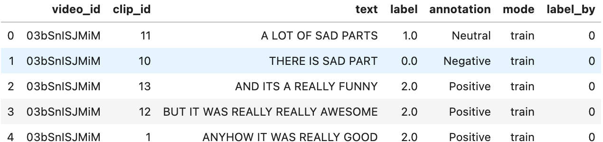

# Backend Documentation

- [Backend Documentation](#backend-documentation)
  - [Datasets](#datasets)
  - [Codes](#codes)
    - [Web Interface Codes](#web-interface-codes)
    - [MM-Codes](#mm-codes)
    - [AL-Codes](#al-codes)
  - [Usage](#usage)

## Datasets

In this section, we introduce the organizational structure of datasets, which should comply with the following structure.

```txt
.
├── config.json
├── MOSEI
│   ├── label.csv
│   ├── Processed
│   └── Raw
├── MOSI
│   ├── label.csv
│   ├── Processed
│   └── Raw
└── SIMS
    ├── label.csv
    ├── Processed
    └── Raw
```

- `config.json`: stating necessary information for all datasets. For example, `language`, `label_path`, `features`, etc. It only works when scanning and updating datasets.
- `**/label.csv`: storing detailed information for each video clip in `**` dataset, including `video_id`, `clip_id`, `normal text`, `label value (Float)`, `annotation (String)`, `mode (training attributes)`. Besides, we define a field `label_by` to indicate the label type, which is necessary for labeling based on active learning.



- `**/Processed`: placing feature files. We use `pickle` to store processed features, which are organized as the following structure. These files are used in `MM-Codes`.

```python
{
    "train": {
        "raw_text": [],
        "audio": [],
        "vision": [],
        "id": [], # [video_id$_$clip_id, ..., ...]
        "text": [],
        "text_bert": [],
        "audio_lengths": [],
        "vision_lengths": [],
        "annotations": [],
        "classification_labels": [], # Negative(< 0), Neutral(0), Positive(> 0)
        "regression_labels": []
    },
    "valid": {***}, # same as the "train"
    "test": {***}, # same as the "train"
}
```

- `**/Raw`: placing raw videos. The path of each clip should be consistent with `label.csv`.

In M-SENA, it is not necessary to put datasets and codes together. In fact, they can be placed in any accessible path.

<!-- 加入SIMS特征文件链接 -->

## Codes

### Web Interface Codes

In the backend, we use `Flask` + `Mysql` to provide the access requests.

```txt
.
├── AL-Codes                # Active learning codes
├── MM-Codes                # MSA algorithm codes
├── app.py                  # Flask main codes
├── config.py               # Basic config
├── config.sh               # Basic config
├── constants.py            # Global variable definition
├── database.py             # Mysql database definition
├── httpServer.py           # Dataset http server
└── requirements.txt        # Python requirements
```

### MM-Codes

> MSA Code Framework

Based on [MMSA](https://github.com/thuiar/MMSA), all model and dataset parameters are saved in `MM-Codes/config.json`.

### AL-Codes

> Labeling based  on Active Learning Code Framework

Based on [MMSA](https://github.com/thuiar/MMSA), all model and dataset parameters are saved in `AL-Codes/config.json`.

## Usage

- Clone the repository

```shell
git clone https://github.com/iyuge2/M-SENA-Backend.git
cd M-SENA-Backend
```

- Install requirements
  -  Install mysql (version 5.7.32)
  -  Install python requirements
    ```
    conda create --name sena python=3.6
    source active sena
    pip install requirements.txt
    ```

- Download datasets and format them according to [Datasets](#Datasets)
- Update global variables in `constants.py`
- Update basic config in `config.sh`
- Run

```
source config.sh
flask run --host=0.0.0.0
```